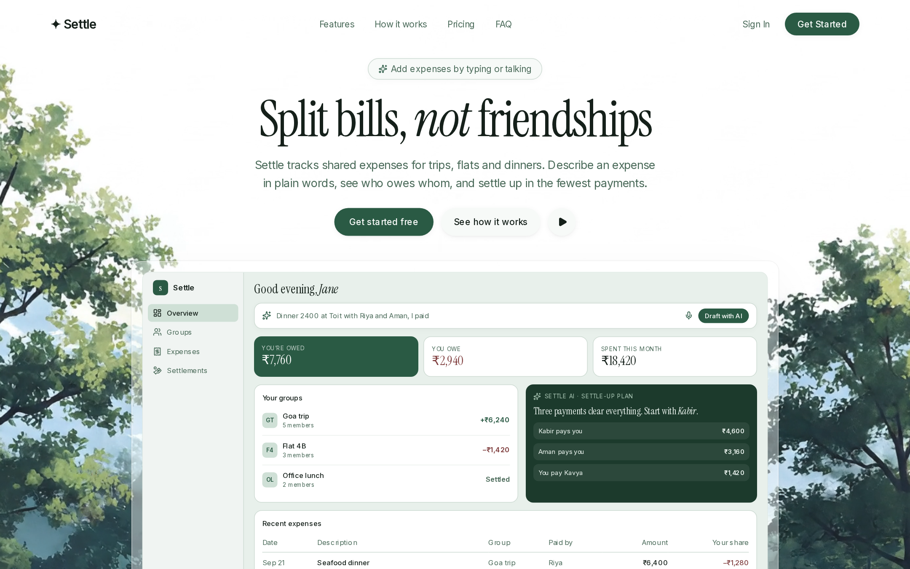

# Settle

Personal expense tracker with groups and settlements. Describe an expense in plain words (or by voice), see who owes whom, and settle up in the fewest payments.



## Features

- **Groups and settlements**: split trips, flats and dinners, with simplified settle-up plans.
- **AI assistant**: chat and expense extraction from text, voice and receipts (LangGraph + Groq).
- **Telegram bot**: add and query expenses from Telegram.
- **Personal tracking**: your share of spending, categories, budgets and recurring expenses.

## Stack

| Path | What |
| --- | --- |
| `apps/web` | Next.js 16 / React 19 app (port 3001): Clerk auth, TanStack Query, AI SDK chat UI, Tailwind 4 |
| `apps/fumadocs` | Public docs site (serves `llms.txt`) |
| `services/api` | FastAPI + SQLAlchemy 2 + Alembic + Postgres (port 8000); source of truth for data and permissions |
| `services/ai` | FastAPI + LangGraph (port 8001); chat and expense-extraction agents |
| `packages/ui` | Shared shadcn/ui primitives (`@settle/ui`) |

Browser -> Next route handlers (`apps/web/src/app/api/**`) -> `services/api` or `services/ai`. See [CLAUDE.md](CLAUDE.md) for architecture details and gotchas, and `llm-docs/` for per-file docs.

## Getting started

Requires Node, npm, [uv](https://docs.astral.sh/uv/) and a Postgres database (Neon in production).

```bash
npm install
cp apps/web/.env.example apps/web/.env
cp services/api/.env.example services/api/.env
cp services/ai/.env.example services/ai/.env
# fill in Clerk keys, DATABASE_URL, GROQ_API_KEY, INTERNAL_API_KEY, ...

uv --directory services/api run alembic upgrade head
npm run dev
```

`npm run dev` starts everything via Turborepo. To run pieces separately:

```bash
npm run dev:web                                                         # http://localhost:3001
uv --directory services/api run uvicorn app.main:app --reload --port 8000
uv --directory services/ai run uvicorn app.main:app --reload --port 8001 --workers 1
```

## Scripts

| Command | What |
| --- | --- |
| `npm run build` | Build the web app |
| `npm run check-types` | Type-check |
| `uv --directory services/api run pytest` | API tests |
| `npm run env:preview` / `env:production` | Sync env vars to Vercel |
| `npm run deploy` / `deploy:prod` | Vercel preview / production deploy |
| `npm run deploy:check` | Dry-run deploy |

## Deployment

Vercel multi-service (`vercel.json`): `web`, `api`, `ai`, region `sin1`. Link the project with `npm run deploy:setup`, then sync env vars (`npm run env:preview` or `env:production`) before the first deploy, since local `.env` files are not uploaded.

## UI

Shared shadcn primitives live in `packages/ui`; add more with:

```bash
npx shadcn@latest add <component> -c packages/ui
```

```tsx
import { Button } from "@settle/ui/components/button";
```

App-specific blocks: run the shadcn CLI from `apps/web`.
